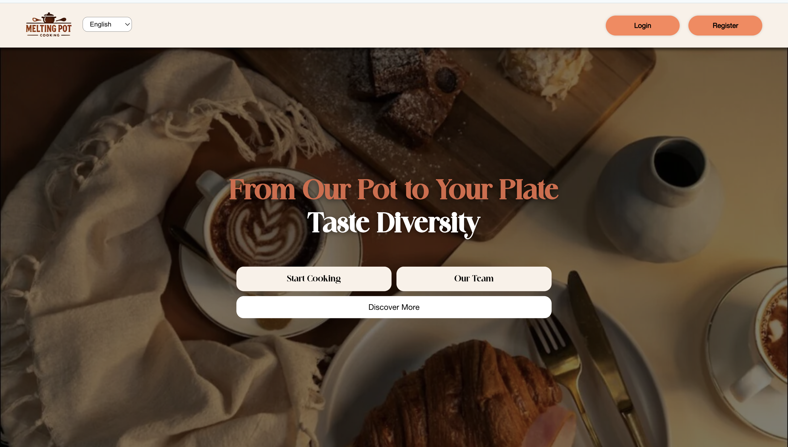
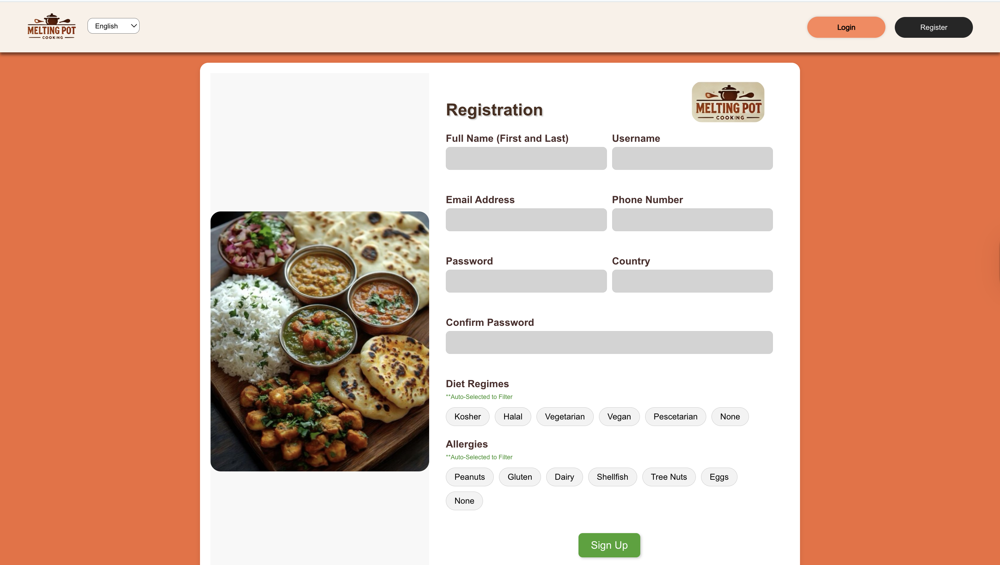
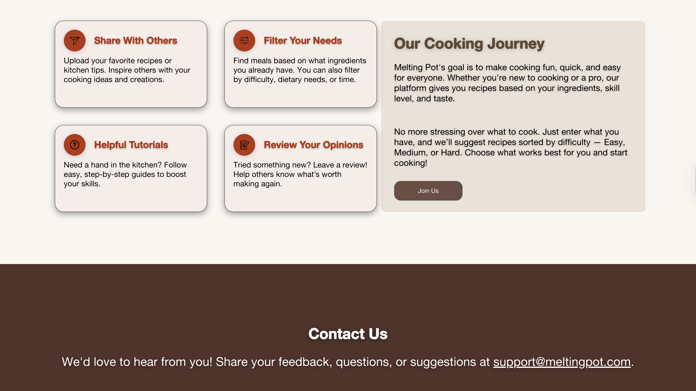

# 🫕 The Melting Pot

A culturally inclusive, social-media-style recipe platform built with **React**, **MySQL**, **Swagger API**, and designed in **Figma**.

> 💡 Developed as part of a semester-long Human-Computer Interaction (HCI) course at the University at Buffalo to promote **food inclusivity**, **accessibility**, and **community-driven cooking experiences**.

---

## 🔍 Overview

The Melting Pot helps users **discover, share, and engage with recipes from diverse cultures**, with a focus on dietary needs, accessibility, and responsive design.  
Users can explore global cuisines while filtering for allergies, ingredients, and skill levels.

---

## ✨ Features

- 📸 Upload and share recipes with images, ingredients, and cooking steps  
- 🍽️ Filter recipes by ingredients, allergies, cuisine, and difficulty  
- 💬 Like, review, and comment on user-submitted recipes  
- ♿ Accessibility-first design following WCAG principles  
- 🌐 Fully responsive UI for mobile and desktop  

---

## 🖼️ UI Preview





---

## ⚙️ Tech Stack


---

## 🚀 Getting Started

Follow these steps to run the project locally:

```bash
# 1. Clone the repository
git clone https://github.com/iamVL/melting.git

# 2. Navigate to the project directory
cd melting

# 3. Install dependencies
npm install

# 4. Start the development server
npm start
